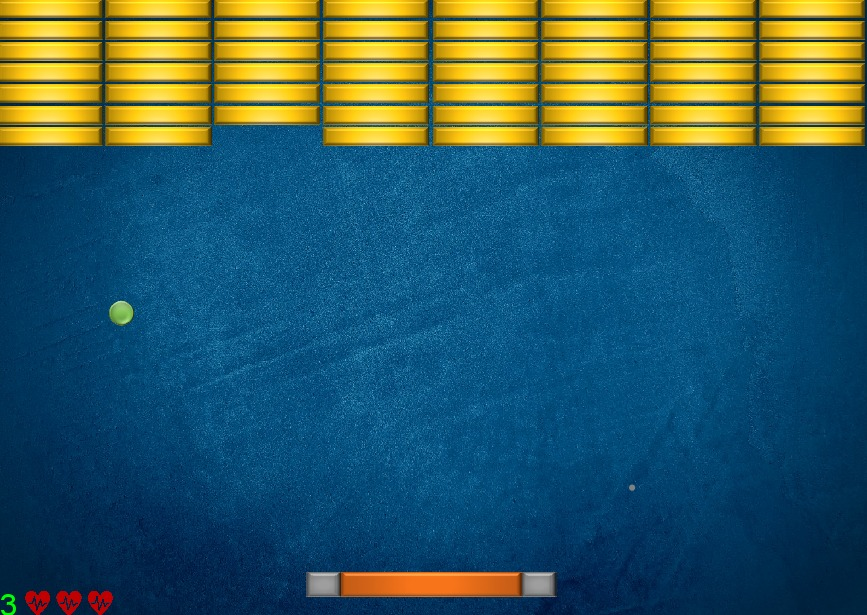
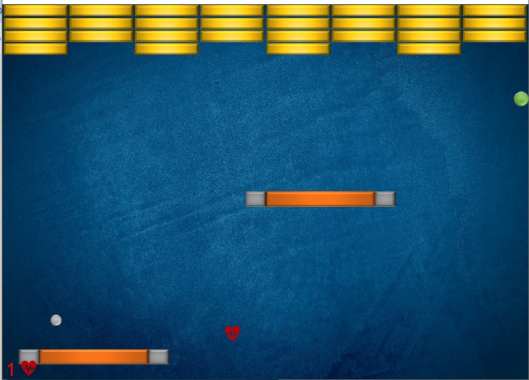

# Bricker Game

The Bricker Game is a Java-based game where players control a paddle to bounce a ball and break bricks. This README provides an overview of the project structure, key classes, and functionalities,
developed using DanoGameLab library.

## Media



## Overview

The Bricker Game consists of several components:
- `BrickerGameManager`: Manages the game logic, including game initialization, updating game state, handling collisions, and managing user input.
- `Brick`, `Paddle`, and `Ball` classes: Represent different game objects with specific behaviors and interactions.
- Collision strategies: Defines various collision behaviors between game objects.
- User interface elements: Displays game information, such as remaining hearts and game prompts.

## Key Features

- Interactive paddle control to bounce the ball and prevent it from falling.
- Dynamic brick layout with configurable rows and columns.
- Collision detection and response mechanisms.
- Sound effects for ball collisions and game events.
- Game over conditions and restart functionality.

## Usage

To run the Bricker Game, follow these steps:
1. Compile the Java source files.
2. Execute the `BrickerGameManager` class, optionally specifying the number of brick rows and columns as command-line arguments.

Example:
```bash
java BrickerGameManager 5 10
```

## License
This project is licensed under the MIT License - see the [LICENSE](https://choosealicense.com/licenses/mit/) file for details.
